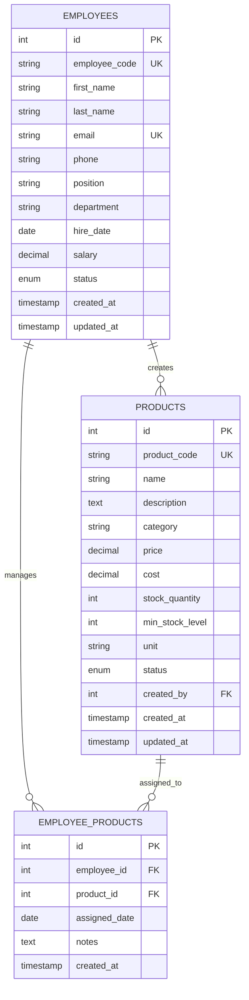

# Entity-Relationship Diagram (ERD)

## Database Schema: Employees and Products

## Entity Descriptions

### EMPLOYEES
- **Primary Key**: `id`
- **Unique Keys**: `employee_code`, `email`
- **Key Attributes**:
  - Personal information: first_name, last_name, email, phone
  - Employment details: position, department, hire_date, salary
  - Status tracking: status (active/inactive/terminated)

### PRODUCTS
- **Primary Key**: `id`
- **Unique Keys**: `product_code`
- **Foreign Key**: `created_by` → EMPLOYEES.id
- **Key Attributes**:
  - Product information: name, description, category
  - Pricing: price, cost
  - Inventory: stock_quantity, min_stock_level, unit
  - Status tracking: status (active/discontinued/out_of_stock)

### EMPLOYEE_PRODUCTS (Junction Table)
- **Primary Key**: `id`
- **Foreign Keys**: 
  - `employee_id` → EMPLOYEES.id
  - `product_id` → PRODUCTS.id
- **Purpose**: Tracks which employees are assigned to manage specific products
- **Unique Constraint**: One employee-product assignment per combination

## Relationships

1. **EMPLOYEES → PRODUCTS (One-to-Many)**
   - One employee can create multiple products
   - Foreign key: `products.created_by`
   - Optional relationship (ON DELETE SET NULL)

2. **EMPLOYEES ↔ PRODUCTS (Many-to-Many via EMPLOYEE_PRODUCTS)**
   - Employees can manage multiple products
   - Products can be managed by multiple employees
   - Junction table: `EMPLOYEE_PRODUCTS`
   - Cascade delete on employee/product removal
